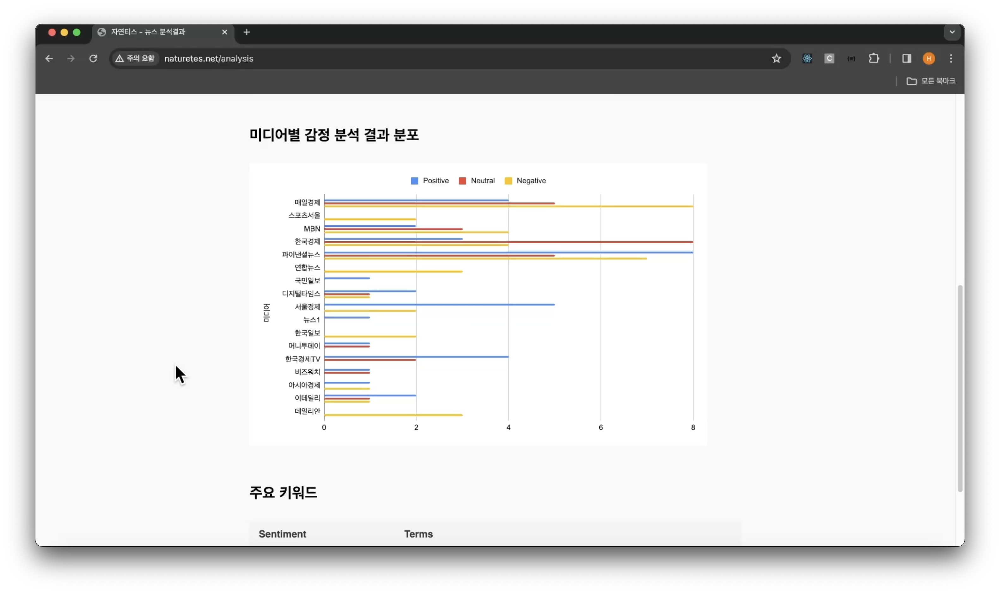

# giantess
goormthon training final project

## 1. Overview
- 프로젝트 이름: 뉴스와 LLM을 활용한 주식매매 타이밍 시스템
- 프로젝트 목표: 회사에 대한 뉴스를 바탕으로 감성분석을 수행하여 시장의 매매 경향을 파악하는 기능 구현에 집중하여, 고객이 증권사 보고서를 보고 매도시점을 파악할 수 없는 문제를 해결하는 솔루션을 제공

## 2. Role & Responsibility
1. 김대성
- 프로젝트 기획
- 실현가능성 조사
- 머신러닝 파이프라인 설계 및 개발
2. 김제환
- 뉴스 데이터 수집
- 데이터베이스 관리
- 웹 크롤링 자동화 시스템 관리
3. 이하민
- 프론트 개발
- 백엔드 개발
- 인프라 구축
4. 초기 6명이었으나, 결원이 생겨서 주제를 축소하고 역할 재분담

## 3. Final Deliverables
- 기능 및 특징
    - 기능 
        - 요약: 뉴스 기사를 요약하여, 감성분석의 효율을 높임
        - 감성분석: 뉴스의 감성을 긍정/중립/부정으로 세분화
        - 개체명 인식: 뉴스에서 키워드를 추출하여, 종목 구체화
    - 특징 
        - 매수종목 추천해주는 기존 투자상담 서비스와 달리, 포트폴리오를 바탕으로 주가가 하락할 자산을 선별에 집중함 
        - 전통적인 비즈니스에서 벗어나 매도를 권장하여 증권시장에 변화를 줌
- 사용 기술 스택
    - 프론트: React, Google Sheets, Axios
    - 백엔드: 익스프레스, CORS, node.js, dotenv, Airtable
    - 머신러닝: Pytorch
    - 데이터베이스: MySQL
    - 배포: Amazon ECR & EKS, GitHub Actions
- 스크린샷

## 4. Lessons and Future Work
- 배운 점
    - 팀워크와 협업: 결원이 발생했을 때 역할분담에서 의견차이가 있을 때 유연하게 대처하는 방법
    - 프로젝트 관리: 목표가 변경되거나 축소되는 상황에서 프로젝트를 재정비하고 완수하는 경험
- 향후 계획
    - 프로젝트가 완료되어, 다른 프로젝트에 집중할 예정

## 5. References
- [최종 슬라이드](https://www.notion.so/LLM-6938a43c85b74ae494f868df2724ba1e?pvs=4#0d0885021b6743f2bd7b84e656e11d88)